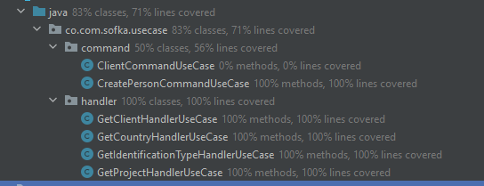

# DATOS TÉCNICOS
## Links Swagger 
 Interface Swagger: http://localhost:8080/swagger-ui/index.html \
 Documentación: http://localhost:8080/v3/api-docs \
 **Nota:** levantar el proyecto en el puerto 8080 y abrir los links anteriores.

##Colección de postman
Se comparte el link de una carpeta en Google drive donde está alojado el archivo .json con la coleccion de las peticiones de postman. \
 **Link:** https://drive.google.com/drive/folders/13flMsTmxPvDeRiNWQ82AWGCrLOQDTeDG?usp=drive_link
##  Covertura 
La covertura está sobre el 80% ya que no se han realizado test del command de creación de clientes porque está por fuera del alcance para esta entrega.

## Diagrama ER 
Se comparte el diagrama ER para la DB Person alojada en AWS como RDS. \
LINK: https://drive.google.com/file/d/1j7sk6I4jYRVVcmGTWZHUBQvul2NQJQOu/view?usp=sharing
# ARQUITECTURA

Empezaremos por explicar los diferentes componentes del proyectos y partiremos de los componentes externos, continuando con los componentes core de negocio (dominio) y por último el inicio y configuración de la aplicación.

## Domain

Es el módulo más interno de la arquitectura, pertenece a la capa del dominio y encapsula la lógica y reglas del negocio mediante modelos y entidades del dominio.

## Usecases

Este módulo gradle perteneciente a la capa del dominio, implementa los casos de uso del sistema, define lógica de aplicación y reacciona a las invocaciones desde el módulo de entry points, orquestando los flujos hacia el módulo de entities.

## Infrastructure

### Helpers

En el apartado de helpers tendremos utilidades generales para los Driven Adapters y Entry Points.

Estas utilidades no están arraigadas a objetos concretos, se realiza el uso de generics para modelar comportamientos
genéricos de los diferentes objetos de persistencia que puedan existir, este tipo de implementaciones se realizan
basadas en el patrón de diseño [Unit of Work y Repository](https://medium.com/@krzychukosobudzki/repository-design-pattern-bc490b256006)

Estas clases no puede existir solas y debe heredarse su compartimiento en los **Driven Adapters**

### Driven Adapters

Los driven adapter representan implementaciones externas a nuestro sistema, como lo son conexiones a servicios rest,
soap, bases de datos, lectura de archivos planos, y en concreto cualquier origen y fuente de datos con la que debamos
interactuar.

### Entry Points

Los entry points representan los puntos de entrada de la aplicación o el inicio de los flujos de negocio.

##Application

Este módulo es el más externo de la arquitectura, es el encargado de ensamblar los distintos módulos, resolver las dependencias y crear los beans de los casos de use (UseCases) de forma automática, inyectando en éstos instancias concretas de las dependencias declaradas. Además inicia la aplicación (es el único módulo del proyecto donde encontraremos la función "public static void main(String[] args)".

**Los beans de los casos de uso se disponibilizan automaticamente gracias a un '@ComponentScan' ubicado en esta capa.**
